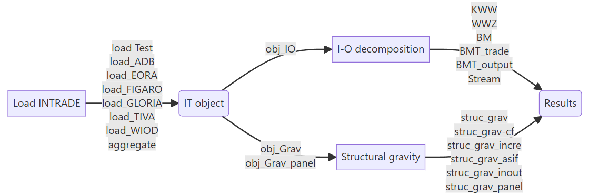

# 0- InTrade-package

---

Description

The `intrade` Python package provides a unified toolkit for empirical work at
the intersection of **input–output analysis**, **structural gravity**, and
**economic complexity**.

It is built around a common world input–output (WIO) object and offers:

- **Data loading & harmonisation**
  - Convenience loaders for major MRIO databases: ADB, Eora26, FIGARO, GLORIA,
    OECD ICIO/TiVA, WIOD, plus small synthetic examples for testing (from: WWZ,decompr and exvatools).
  - A consistent internal format (countries × sectors × final demand) designed
    to make different data sources interchangeable in downstream analysis.

- **Global Value Chain (GVC) and value-added trade analysis**
  - Wang–Wei–Zhu (WWZ) decomposition and Koopman–Wang–Wei(KWW) style aggregation of domestic and
    foreign value added in exports.
  - Borin & Mancini (BM) –type decompositions of value added in gross exports
    using a WIO object.

- **Structural gravity modelling**
  - Panel gravity estimation using PPML with flexible exporter, importer,
    time and bilateral fixed effects.
  - Structural gravity counterfactuals with exact-hat algebra in the spirit of
    Anderson–van Wincoop and ACR-style welfare analysis (changes in exports,
    real income, output and consumer prices).

The library is intended for researchers and practitioners working with
**multi-country input–output tables** and **bilateral trade data**, providing
modular building blocks for both teaching and applied research in trade,
GVCs and development.

The package aims to complement existing tools such as the R packages  `decompr` or `exvatools` for decomposition and typical gravity toolkits, but in the Python ecosystem.

Flow chart

Main dependencies

- `numpy`
- `pandas`
- `statsmodels`
- `scipy`
- `os`
- `glob`
- `zipfile`
- `re`
- `itertools`
- `pyfixest`
- `traceback`
- `statsmodels.api`
- `from scipy import optimize`
- `from natsort import natsorted`
- `from zipfile import ZipFile`

References

- Arkolakis, C., Costinot, A., & Rodríguez-Clare, A. (2012). New trade models, same old gains? American Economic Review, 102(1), 94–130.
- Anderson, J. E., & van Wincoop, E. (2003). Gravity with gravitas: A solution to the border puzzle. American Economic Review, 93(1), 170–192.
- Borin, A., and Michele Mancini, M. (2023). “Measuring What Matters in Value-Added Trade.” Economic Systems Research, January, 1–28. https://doi.org/10.1080/09535314.2022.2153221.
- Borin, A., Mancini, M. & Taglioni, D. (2025) "Economic Consequences of Trade and Global Value Chain Integration: A Measurement Perspective", The World Bank Economic Review, lhaf017, https://doi.org/10.1093/wber/lhaf017
- Hummels, D., Ishii, J., & Yi, K. M. (2001). The nature and growth of vertical specialization in world trade. Journal of International Economics, 54(1), 75–96. https://doi.org/10.1016/S0022-1996(00)00093-3.
- Koopman, R., Wang, Z., & Wei, S. J. (2014). Tracing value-added and double counting in gross exports. American Economic Review, 104(2), 459–494.  https://doi.org/10.1257/aer.104.
Quast, B., & Kummritz, V. (2015). decompr: Global value chain decomposition in R (CTEI Working Paper No. 1). The Graduate Institute, Geneva. https://qua.st/decompr/.
- OECD. 2023. “OECD Inter-Country Input-Output Database.” http://oe.cd/icio.
- Remond-Tierrez, I., and Rueda-Cantuche, J.M. eds. (2019). EU Inter-Country Supply, Useand Input-Output Tables: Full International and Global Accounts for Research in Input Output Analysis (FIGARO): 2019 Edition. LU: EU Publications Office. https://doi.org/10.2785/008780.
- Wang, Z., Wei, S. J., & Zhu, K. (2013). Quantifying international production sharing at the bilateral and sector levels (NBER Working Paper No. 19677). National Bureau of Economic Research. http://www.nber.org/papers/w19677.pdf.

---

